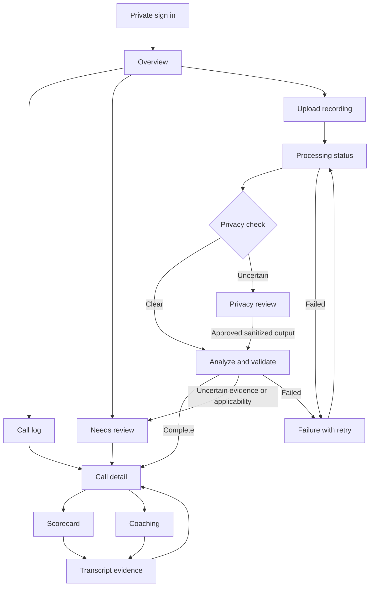

# PestLaunch Call Intelligence — product and screen design

Status: implementation handoff authorized by the user on 8 October 2026. The product design is retained; the selected architecture is Vercel + Supabase + Groq. Application code and cloud provisioning begin in the GPT-6.1 Sol Medium implementation chat. No agreed recruiter test clock is confirmed.

## Product decision

Build one private call-review workspace that helps an owner answer: what happened, how well did we handle it, and what needs attention? The defining interaction is **score → evidence → coaching**. Every positive claim has a traceable transcript segment; uncertainty remains visible.

The written assignment owns minimum scope. The walkthrough supplies product context. The manuals own rubric definitions. The recordings expose real-world cases but are not reference grades.

## Source register

All five folders and 25 files were checked: one instruction document, 20 recordings, one spreadsheet, two manuals, and one context document containing the walkthrough link. Calls were reviewed using local machine transcription; uncertain passages were flagged and no final numerical grades were assigned.

- [Assignment and confidentiality requirements](https://docs.google.com/document/d/1UWDypghFlDjjjsRX3yO9zmiy0FWdfMsx-zfTmNVVZZk/edit)
- [Office manual: general, scheduling, billing, re-service, retention](https://docs.google.com/document/d/1xSofO54L_TY5MnkbO_Wq2DiEZdXdOgJVmCb2OVLr4lE/edit)
- [Sales manual](https://docs.google.com/document/d/11MmhUKGkMc2cx4NFTLHV-RRk0rrDxz3U/edit)
- [Candidate Call Data](https://docs.google.com/spreadsheets/d/1tgf1dAiTliBHRBDH0vbCXJSLLYH-Kn8OyQtqrmFJILA/edit)
- [PestLaunch walkthrough](https://www.loom.com/share/ec29c77809a7423d946f6ea401cab468)

Source gaps: no supplied transcripts, reference grades, rep identities, original recording timestamps, directions, application source code, or detailed technical specification. The invitation says 48 hours; the document says 72. Confirm the agreed start/end time before starting the timed test.

## External references and what to borrow

These are interaction references, not brand or business-policy sources.

| Reference | Verified principle | Adaptation |
| --- | --- | --- |
| [Linear's interface refresh](https://linear.app/now/behind-the-latest-design-refresh) | Task content gets more emphasis than navigation; actions occupy predictable places | Quiet sidebar, consistent top bar, compact local tabs, fewer decorative separators |
| [Gong scorecards](https://help.gong.io/docs/create-and-manage-scorecards) | Structured call feedback with controlled visibility and coaching resources | Rubric checkpoints, individual evidence, private review, specific next-practice suggestions |
| [Fathom review experience](https://help.fathom.video/en/articles/13926529) | Recording review with summary, action items, and transcript views | One call workspace with persistent recording context and clear local tabs |

PestLaunch remains the visual anchor: light neutral canvas, blue accent, rounded white surfaces, left navigation, owner-facing clarity. Borrow interaction principles rather than copying screenshots.

## Three approaches

1. **Calm workspace — recommended.** Familiar PestLaunch sidebar; small owner overview; call list; detail view with summary/scorecard/coaching beside a transcript. Best balance of brand fit, owner simplicity, and review depth.
2. **Review desk.** Persistent call queue beside a dense detail pane. Fastest for sequential QA, but crowded for owners and narrower screens.
3. **Coaching brief.** Large outcome and next-practice narrative, with evidence revealed on demand. Easiest to read, but slower for full scorecard auditing.

Use Calm workspace as the V1 default. Borrow next/previous-call navigation from Review desk and concise coaching language from Coaching brief. The interactive preview contains all three approaches and fictional examples only.

## Scope and acceptance

| ID | Requirement | Evidence of completion |
| --- | --- | --- |
| R01 | Process a new recording | Upload a previously unseen synthetic recording; persistent job finishes with a usable result |
| R02 | View transcript and recording | Authorized reviewer can read segments and jump to their timestamps |
| R03 | Classify call purpose | Primary purpose plus secondary intents; unknown is supported |
| R04 | Extract outcome/details | Separate inspection, treatment acceptance, agreement, payment, and promised actions |
| R05 | Apply correct scorecard | Fixed 17/12/12 definitions, deterministic totals, evidence, applicability handling |
| R06 | Useful employee coaching | Strength and improvement linked to rubric/evidence, with a specific better response |
| R07 | Review all calls/results | Searchable/filterable log with processing, failed, ready, and review-needed states |
| R08 | Fit PestLaunch | Coherent shell, typography, spacing, blue accent, restrained motion, responsive layouts |
| R09 | Private test data | Authenticated API/media, private repo/storage, safe logs, redacted presentation |
| R10 | Deployed submission | Private HTTPS app, source repo, README, short synthetic/redacted Loom |
| R11 | Reliable operation | Durable jobs, duplicate handling, bounded retry, restart recovery, versioned analyses |
| R12 | End-of-test deletion | Source/derivative/transcript/result/review copies and backups removed with a non-content receipt |

V1 excludes CRM integrations, automatic customer linking, pipeline movements, external task delivery, a business chatbot, billing, public sharing, and employee ranking from absent rep metadata. The walkthrough's broader direction remains future scope.

## Information architecture

Within the standalone PestLaunch shell: Overview, Calls, Needs review. Upload is one consistent primary action. Data controls is in workspace settings, not the main navigation. Do not render dummy CRM, finance, or team screens.

Routes: `/login`, `/overview`, `/calls`, `/calls/:callId?tab=summary|scorecard|coaching|transcript`, `/review`, `/settings/data`. Preserve call-log query/search/scroll state on return. Direct links require authorization and work after reload.

## Screen flow

### Sign in

Small private-workspace screen with email/password through invite-only Supabase Auth, one submit action, generic failure, and clear focus. Invite-only accounts; no public signup. Reviewer and owner are separate roles. No customer data exists in logged-out HTML, browser storage, titles, or error responses.

### Overview

Header: Call Intelligence, clear dataset scope, Upload call. Four clickable values: analyzed calls, inspections booked, treatments accepted, needs review. Show processing/failure coverage adjacent to analyzed count. One attention list and one compact recent-call list. Avoid empty charts and invented trends.

All outcomes are **call-level observations**, not unique customers or revenue. No sales close-rate denominator until eligible opportunity semantics are defined. Rep grouping and calendar filtering remain unavailable when source metadata is absent. Upload date is never substituted for recorded date.

### Call log

Search sanitized content; filters for primary purpose, outcome, processing status, grade and review status. Rows show call identifier, one-line concern, type with secondary-intent label, outcome, grade or review-needed label, duration, and status. Unknown metadata reads Not provided. Use stable sorting, keyboard-operable row links, visible empty/reset state, and accessible filter labels.

At narrow widths use call cards containing the same key fields; no page-wide table overflow. Return from detail keeps filters and location. Display final grades from the active analysis version only.

### Upload and processing

Dialog: select/drag one or multiple MP3/WAV/M4A files; optional rep, direction and original recorded time. Use a 60-minute duration ceiling and an honest file-size limit verified against the configured Supabase/Groq tiers. Upload directly to private Storage; support resumable upload or timestamp-preserving chunks when required. Do not pass audio through a Vercel Function request body (4.5 MB limit). Files are decoded and validated server-side; filenames are display labels rather than storage paths. Duplicates offer Open existing or explicit Reprocess.

Stages: queued → transcribing → privacy check → analyzing → scoring → ready / needs review. Progress reflects completed stages, not a fabricated percentage or estimated remaining time. Dialog may close safely; persistent status remains in call log. Failures identify an actionable category and retry from the last valid stage.

### Call detail

Header: back to calls, identifier, purpose, outcome, duration, review state, next/previous navigation. Desktop has a 60/40 split: interpretation left, searchable transcript right. Recording strip spans the workspace; segment clicks seek sanitized audio. Summary, Scorecard, Coaching and Transcript tabs work on narrow screens. Keep one dominant reading area; don't stack every analysis panel simultaneously.

Summary shows What the customer needed, What was agreed, Important details, and Follow-ups. Each extracted fact carries segment IDs. Follow-ups use Promised / Accepted / Reported completed / Unknown; none implies verified CRM execution. Prices include currency, initial versus recurring, service versus billing intervals, and conditional status. Keep relative dates in source wording unless original timestamp is known.

### Scorecard and evidence

Group checkpoints into Validate, Understand, Solve, Verify. A row shows checkpoint, Passed / Missed / Policy award / Unclear / Not applicable, and supporting evidence or reason. Clicking evidence highlights the transcript and seeks audio; missed checkpoints explain the absent behavior and the reviewed call range.

The total is computed by code. Unknown or non-applicable items prevent an official Gold/Green/Below grade; display a partial assessment and Needs review. Show the original denominator and unresolved count. Reviewer decisions preserve the original model assessment and a reasoned audit record. An applicability exception cannot silently convert into a pass.

### Coaching

One specific strength, one or two prioritized improvements, an evidence link, and a concrete better response. Say what to practice next, rather than repeating the full rubric. Distinguish call handling from sales success. No invented tone, interruption, or speaker-confidence scores. Block rep-specific claims if speaker attribution is uncertain.

### Review queue and data controls

Group review reasons: privacy, unclear transcription, outcome contradiction, missing evidence, applicability, speaker attribution. Reviewer can inspect sanitized content, correct a fact or checkpoint with a reason, and recompute deterministically. Owner handles raw sensitive passages only in a separate restricted privacy-review mode. No ordinary raw-audio route.

Owner-only data controls list retained artifact counts and allow delete-one/delete-test-data after deliberate confirmation. Deletion stops active jobs, removes all artifacts and related DB rows, invalidates media access, and verifies zero remaining copies. Preserve only a receipt with timestamp and counts, never customer content.

## Visual specification

Fixed light product theme, consistent with the supplied walkthrough. Background `#F5F7FA`; surface `#FFFFFF`; ink `#182332`; secondary `#526174`; border `#E2E7EF`; action blue `#2563EB`. Gold/Green/Below include words and icons, not color alone. Amber indicates review, not a failed employee.

Use a local/system sans stack for the test; no external fonts or analytics in the private app. Body 14–16 px, labels at least 12 px, page title 26 px; tabular numerals for scores. Spacing scale 4/8/12/16/24/32; card radius 12 px, control radius 8 px. Desktop sidebar 208 px; content max width 1440 px. Reading lines stay 60–75 characters.

One primary action per surface. Icons support labels. Focus rings remain visible. Touch targets at least 44 px. Below 900 px collapse the sidebar and stack the reading panes; below 600 px switch lists to cards. Motion is limited to 120–180 ms transitions and respects reduced motion.

UX acceptance: owner finds a flagged call in two navigation actions; reviewer reaches supporting evidence from a grade in one click; no misleading sale/payment/CRM-completion labels; no sample grades presented as real call results. Verify 320/390/768/1024/1440 widths, keyboard navigation, 200% zoom, WCAG AA contrast, loading, empty, failed and unknown states.

## Scoring policy v0.1

Sales has 17 exact checkpoint IDs: validate, confidence, expectation_understand, investigate, summary, expectation_solve, solution, consensus, close, pricing, objection_agree, objection_restate, objection_resolve, objection_reclose, conclusion, final_information, thank.

General has 12: validate, confidence, expectation_understand, investigate, summary, expectation_solve, solution, consensus, close, conclusion, thank, final_information.

Retention has 12: validate_confidence, transition, research, investigate, validate_summary, validate_expectation, solution, consensus, repeat, conclusion, thank, teaser.

| Rubric | Gold | Green | Below |
| --- | --- | --- | --- |
| Sales | 17/17 | 14–16/17 | 0–13/17 |
| General | 12/12 | 11/12 | 0–10/12 |
| Retention | 12/12 | 11/12 | 0–10/12 |

Award the four sales-objection points by policy only when the complete call clearly contains no objection. Uncertain or incomplete transcription does not prove absence. Scheduling's lighter Understand section, no-cost re-service Close, retention Repeat/Teaser, and out-of-area/deceased exceptions need explicit applicability reasons. Do not normalize thresholds onto a reduced denominator. Internal research/account changes are not assumed from a promise.

Inspection-stage sales and outbound prospect calls retain their purpose but receive applicability review; the sales manual describes inbound sales and does not define every alternate stage. Manuals' prices and policies are examples, not universal business rules; one sales example also has inconsistent discount arithmetic.

## Selected technical architecture

Next.js App Router + TypeScript on Vercel; Tailwind/custom shadcn/Lucide; Supabase Postgres, invite-only Auth and private Storage; Groq transcription and structured analysis; Vercel Workflows for durable execution. This is the selected user-approved direction and supersedes the older FastAPI/SQLite/local-model/Render proposal.

Frontend and server API share the Next.js project. Direct authenticated/private uploads avoid the Vercel function 4.5 MB body limit. Workflow stages receive call/job IDs, load and store content through protected Supabase services, and return only safe IDs/metadata. No persistent SQLite file or continuously running worker is assumed on Vercel.

Groq is the only hosted AI provider, with one server-side account/key. Preferred transcription candidate: whisper-large-v3 with timestamps. Preferred structured-analysis candidate: openai/gpt-oss-120b after current availability, strict-schema support, quota and accuracy checks. The earlier Qwen 3.8 27B suggestion is a preview candidate; model names do not establish verified call-analysis quality. Preserve model/prompt/schema/rubric versions.

Verify Zero Data Retention and no-training policy before real calls. Privacy-preflight known unsafe media locally, especially CALL-013, before provider upload. Other protected test recordings may undergo hosted transcription after verified data handling; uncertain identifiers or redaction boundaries hold ordinary presentation until owner review. Redact/minimize transcript content before analysis and produce sanitized playback.

Supabase Auth identifies users; protected workspace membership supplies authorization. Enable and test row/bucket policies for owner/reviewer and cross-workspace denial. Server secrets never enter browser code. Reviewer receives sanitized content; raw privacy operations remain owner-only and explicitly restricted.

Durable stages persist idempotency, version, retry and deletion state. Rate-limit waits use workflow suspension, not an hours-long function invocation. IDs-only workflow state limits confidential-content retention; check actual Vercel/Supabase/Groq logs/backups/deletion settings before release.

The current Vercel Hobby plan is personal/non-commercial only. Use existing authorized Pro resources or a specifically approved commercial plan, without purchasing upgrades automatically. The Supabase connector requires target-organization selection and actual cost confirmation for creation. Account visibility is not setup or spending approval; finish independent local work while resolving these prerequisites.

Current implementation references: [Vercel Workflows](https://vercel.com/docs/workflows), [function limits](https://vercel.com/docs/functions/limitations), [Supabase private buckets](https://supabase.com/docs/guides/storage/buckets/fundamentals), [Groq transcription](https://console.groq.com/docs/speech-to-text), [Groq structured outputs](https://console.groq.com/docs/structured-outputs), [Groq data controls](https://console.groq.com/docs/your-data). Verify current docs and pin dependency/model choices during implementation.

## Processing and data rules

Persist upload hash, metadata and durable job. Decode audio; keep stereo channels when genuinely separated and verify role mapping. Mono segments use unknown speaker unless attribution is reliable; channel identity does not establish employee identity. Preserve word/segment timestamps, quality indicators and completeness.

After privacy preflight and provider-retention verification, transcribe through Groq, redact customer identifiers/payment exchanges, produce sanitized recording/transcript derivatives, then analyze minimized text with strict schemas. Known unsafe CALL-013 is locally sanitized before any provider upload. Payment-context redaction covers the entire exchange, spoken digits and overlapping timestamps, with padded audio intervals. Uncertain privacy scans hold ordinary presentation until owner review. CALL-013 is a mandatory privacy regression case; no credentials enter logs, fixtures, previews, or the repo.

Analyze purpose/outcome/facts first, then rubric checkpoints, then coaching. Treat transcript text as untrusted content, never executable instructions. Validate segment references, speakers, quotes, date provenance, prices, outcome combinations and checkpoint IDs. Invalid evidence becomes a review issue, not an invented citation.

Store analyses append-only with ASR model, analysis model/version, prompt/schema/rubric/redaction versions. A review creates a new effective version with reason and author; old model values remain distinguishable until deletion. All API access is authenticated; all media and responses use no-store. No real customer data in browser localStorage, source-control fixtures or telemetry.

## Privacy, operational limits and open prerequisites

Private invite-only app and repository, protected Supabase rows/private objects with verified encryption/retention, HTTPS, owner/reviewer roles, bounded upload limits, session protection, throttled login, no content logs, and explicit deletion of copies/backups after the test. Raw media never becomes a public object or share link.

Before real-data integration, verify target Supabase organization/project, Groq credentials/ZDR, privacy preflight, storage/log/backups handling and reviewer authorization. Confirm the administrative test window separately; the user already authorized current implementation. Continue local work while specific integration prerequisites are pending. The application must process a new call for the deployed reviewer; local precomputed sample results alone do not satisfy R01.

## Design self-review

- Minimum requirements R01–R12 map to the implementation plan's tasks and release checks.
- Numeric grades use original thresholds; unresolved applicability cannot fabricate a final grade.
- Missing dates/reps remain explicit; no upload-time substitution or invented per-rep dashboard.
- Privacy includes sanitized playback, raw access restrictions, logs, derived outputs and deletion.
- Fictional preview data is separate from real-call context notes.
- One bounded private test product; integration and automation scope stays deferred.

